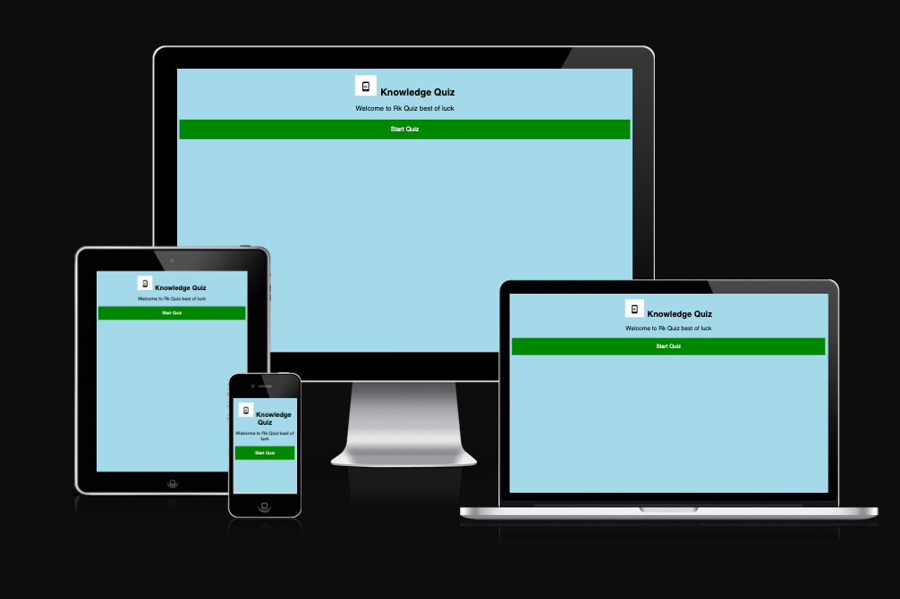
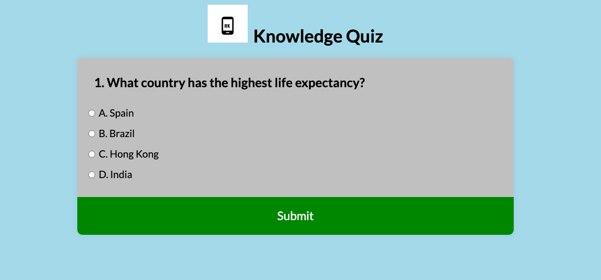
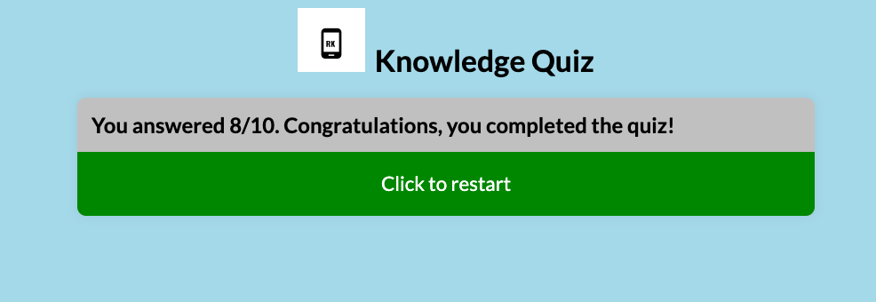

# RK Knowledge Quiz

This Quiz is designed to help users expand or refresh their knowlege of culture, sports, countries and more. It's a fun and engaging quiz for both parents and children to enjoy together.

RK Quiz is a site that aims to demonstrate how pure JavaScript can be effectively utilized in a real-world context. The site is targeted towards individuals who not only love to implement more advanced JavaScript concepts but also test their general knowledge.

## Features

Responsive site. The quiz site is designed to be fully responsive, ensuring a seamless user experience across various devices and screen sizes.

### Existing Features

- __RK Knowledge Quiz Logo and heading__

  - The logo is at the top of the page easy to see. This allow the users to see the logo and the name of the quiz.

- __Welcome__

  - This is the welcome page. This page will allow the user the begin the quiz by clicking the start butto. and also display the best luck message. 

- __Quiz Area__

  - This section will allow the user to see the quiz questions. 
  - The users will be able to do the quiz and to select the answer after reading the quiz question. 

- __Result__

  - This section will allow the user to see the quiz result after submitting the all the answers.  

### Features left Implement 

There are several features that could enhance the user experience and functionality of the site. Here are some potential features to consider implementing.

 - Mobile App versions
 - Random questions
 - Timed Quizzes : implement a timer for each quiz questions.
 - Leaderboard : introduce a leaderboard that will display top score.

 ### Testing 

 used different website to test all my code html, css, javascript code. 

 ### Validar Testing 

 - HTML
     - No error were found when testing
     [W3C Markup Validator](assets/images/htmlValidation.png)

- CSS
     - No error were found when testing 
     [Jigsaw Validator](assets/images/cssValidation.png)

- Javascript 
    - No errors were found when testing my javascript code from the official [Jshint validator](https://jshint.com/)

    - This the metrics we got from the testing: 

    - There are 7 functions in this file.

    - Function with the largest signature take 1 
    arguments, while the median is 0.

    - Largest function has 8 statements in it, while the median is 3.

    - The most complex function has a cyclomatic complexity value of 4 while the median is 1.

### Unfixed Bugs

No bugs

### Deployment

- The site was deployed to GitHub pages. The steps to deploy are as follows: 
  - In the GitHub repository, navigate to the Settings tab 
  - From the source section drop-down menu, select the Master Branch
  - Once the master branch has been selected, the page will be automatically refreshed with a detailed ribbon display to indicate the successful deployment. 

Click here to see the live project [GitHub Repository RK Knowledge Quiz](https://ramyapepone.github.io/rk-knowledge-quiz/)

### Local clone

1. Log in to GitHub and locate [GitHubRepository RK Knowledge Quiz]()
